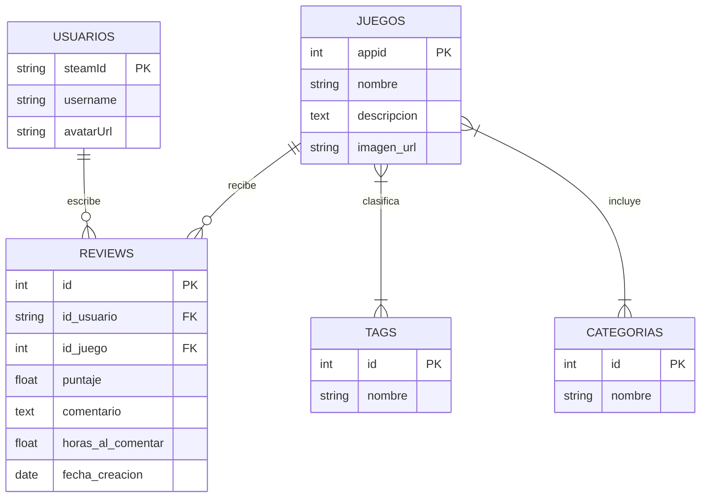

## 🎯 1. Concepto Central y Flujo Esencial 

La aplicación web está orientada **estrictamente a usuarios de Steam**. Centraliza el registro de opiniones, calificaciones de 1 a 5 estrellas y el historial de juego real de los usuarios, eliminando la fricción de registros tradicionales y acotando el alcance social al mínimo para asegurar la viabilidad del proyecto.

## 🛠️ 2. Arquitectura & Stack Tecnológico

Se optó por una **arquitectura desacoplada (SPA + API Rest)** basada en tecnMVC/CSREologías estándar, robustas y de alta adopción en el mercado para justificar la mantenibilidad y escalabilidad ante el tribunal.

- 💻 **Frontend:** React (Vite) + Tailwind CSS + Shadcn/ui.
    
    - _Justificación:_ Interfaz moderna con modo oscuro nativo, carga ultra rápida y componentes de UI listos para evitar fatiga de diseño.
        
- ⚙️ **Backend:** Node.js + Express.
    
    - _Justificación:_ Unificación de lenguaje (JavaScript/TypeScript) y soporte nativo para `passport-steam` para resolver la autenticación.
        
- 🗄️ **Base de Datos:** PostgreSQL o MySQL.
    
    - _Justificación:_ Modelo relacional clásico óptimo para las entidades del sistema y el cruce de datos.
        
- 🔐 **Autenticación:** Steam OpenID (OAuth 2.0).
    
    - _Justificación:_ Cumplimiento de estándares de seguridad (OWASP) al no almacenar credenciales locales (sin passwords en la DB local).

## 🧠 3. Modelo Híbrido de Datos (API + Dataset Local)

Para evitar el **Rate Limit** de la API de Steam (`appdetails`) y garantizar un rendimiento óptimo de la barra de filtros, el sistema operará bajo un esquema híbrido:

1. **Fase de Actividad (En vivo):** Al loguearse, la API de Steam (`GetOwnedGames`) devuelve solo los `AppID` y las horas de juego reales del usuario.
    
2. **Fase de Enriquecimiento (Local):** Esos `AppID` se cruzan con la base de datos local, alimentada previamente por el dataset de Kaggle (`SteamGames_cleaned.csv`), resolviendo nombres, portadas y tags al instante.

### 🗄️ Estructura Relacional de la Base de Datos

## 🖼️ 4. Mapa de Navegación y Permisos Frontend

El alcance social se blinda para evitar complejidades técnicas como sistemas de mensajería, seguidores o notificaciones.

### 🏠 Vista 1: Dashboard Personal (Privado - Solo Dueño)

- [ ] Grilla con los juegos de la cuenta de Steam actualizados con sus horas de juego.
    
- [ ] Historial CRUD (Crear, Leer, Editar, Borrar) de las reseñas propias.
    
- [ ] Formulario/Modal de puntuación (1 a 5 estrellas + texto libre).
    

### 🔍 Vista 2: Catálogo Global / Explorar (Público)

- [ ] Buscador de texto e integración de la **Barra de Catálogo** para filtrar juegos por Tags/Géneros.
    
- [ ] Ficha técnica del juego (metadata del dataset de Kaggle).
    
- [ ] Feed global con todas las reviews que la comunidad de la app dejó sobre ese juego en específico (mostrando las horas que tenían al comentar).
    

### 👤 Vista 3: Perfil de Terceros (Público - Solo Lectura)

- [ ] Vista estática del perfil de otro usuario.
    
- [ ] Historial de sus reseñas publicadas.
    
- [ ] **Restricción:** Sin botones de interacción, edición o mensajería.

## 🚫 5. Límites del Alcance (Exclusiones Explícitas para la Defensa)

> [!warning] **Importante para frenar preguntas del tribunal**
> 
> - **No Multiplataforma:** Exclusivo del ecosistema Steam (PC). No integra consolas ni otras tiendas (Epic, GOG).
>     
> - **No Registro Tradicional:** El acceso es 100% dependiente de poseer una cuenta de Steam activa y pública.
>     
> - **No Red Social Compleja:** No hay chat, no hay sistema de amigos interno, no hay likes. Es un sistema de consulta e información.
>     

## 📋 6. Checklist de Entregables Académicos

### 🔄 Modelado Dinámico

- [ ] **BPMN:** Proceso "Publicar Reseña" (Carriles: Usuario, WebApp, API Steam).
    
- [ ] **Diagrama de Secuencia:** Flujo del Login OpenID y la importación/cruce de la biblioteca.
    
- [ ] **Máquina de Estados:** Ciclo de vida de una `Review` (Borrador -> Publicada -> Editada -> Eliminada).
    

### 📊 Modelado Estático

- [ ] **Diagrama de Clases UML:** Estructura del backend (Controladores, Servicios de API, Entidades del ORM).
    
- [ ] **Modelo Entidad-Relación (DER):** Detalle de tablas, tipos de datos, claves primarias y foráneas (énfasis en la tabla intermedia de Tags).
    
- [ ] **Vistas Arquitectónicas / Despliegue:** Mapa físico de infraestructura (Vercel/Render/Supabase).
    

### 💻 Desarrollo & Datos

- [ ] Script de ETL / Seed en Node.js para migrar el CSV de Kaggle a la base de datos local relacional.
    
- [ ] Configuración del Middleware de autenticación Passport-Steam.
    
- [ ] Maquetado UI de la barra de filtros por categorías en el catálogo.

## ⁉️ 7. Edge Cases a Contemplar
> [!warning] **Casos a tener en cuenta**
> - El usuario tiene la biblioteca vacia.
> - El usuario tiene la biblioteca privada.
> - ETC.

## 🔒 8. Seguridad del Sistema
> [!warning] **Consideraciones de Seguridad y Mitigación de Riesgos (OWASP)**
> 
> - **Mitigación de XSS (Cross-Site Scripting):** Confianza en el motor de renderizado de React, el cual aplica sanitización y *auto-escaping* nativo de variables en el DOM. Se prohíbe estrictamente el uso de `dangerouslySetInnerHTML` en el pintado de reseñas comunitarias.
> 
>     
> - **Prevención de SQL Injection (SQLi):** Uso obligatorio de un ORM (o consultas parametrizadas) en la capa del Backend (Node.js). Ninguna consulta a la base de datos se construirá mediante concatenación directa de strings provistos por el usuario.
> 
>     
> - **Seguridad de Sesiones (Capa de Transporte):** Los tokens JWT emitidos tras el login con Steam se gestionarán mediante cookies con banderas `HttpOnly` y `Secure` (o almacenamiento local protegido), evitando su lectura mediante scripts de terceros.
> 
> - **Prevención de Denegación de Servicio (DoS por Payload):** Configuración de límites estrictos en los parsers de Express (`limit: '10kb'`) para rechazar peticiones anormalmente grandes en el apartado de reviews, protegiendo el Event Loop y la memoria del servidor.
